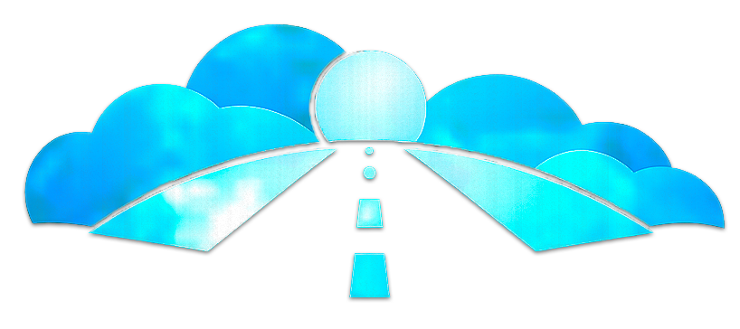

<p align="center">
  
</p>

# caLLM (Open Runway) — Universal LLM Orchestrator


[](https://github.com/semezzato/callm-open-runway)
[](#)
[](#)

**caLLM** (pronounced *calm/call-em*) or **Open Runway** is a high-performance orchestration engine designed for senior developers and "vibecoders" who demand precision, technical logic, and extreme efficiency.

> **"Keep caLLM and Runway"** — Run your models on the elite automation runway with zero mental friction.

---

## 🌟 Key Features
- **Anti-Vibecoding Engine**: A logic-first development philosophy focused on 90% token reduction through structured thought and clean context management.
- **Universal Multi-Channel**: Seamlessly switch between CLI, Desktop (Tauri), Web, Mobile (Capacitor), and Browser Extensions.
- **Native Browser Interaction**: Integrated DOM manipulation engine to perform complex workflows or data extraction directly in the browser.
- **Local & Remote Intelligence**: Native support for Google Gemini, Claude, OpenAI, and local models via Ollama or llama.cpp.
- **Hacker-Centric Architecture**: Hexagonal design patterns, 12-factor compliance, and security-by-design at every layer.

---

## 🛠️ Technological Stack
- **Monorepo**: Centralized management of all applications and packages.
- **Tauri + React**: Ultra-lightweight Desktop UI with native performance.
- **Node.js + Playwright**: Next-gen browser automation and data mining.
- **SQLite + Knex**: High-speed local persistence for conversation history and "digital neurons".
- **Vitest**: Blazing fast TDD infrastructure for mission-critical reliability.

---

## 🚀 Quick Start (CLI)

### Install Dependencies
```bash
npm install
# caLLM (Open Runway) 🚀


O orquestrador de LLMs universal, modular e de alta performance, projetado para desenvolvedores seniores.

## ✨ Funcionalidades Elite
- **🧠 Camada Cognitiva (Neurônios)**: Memória persistente de longo prazo. O sistema aprende com cada interação e recorda conhecimentos em sessões futuras.
- **🌐 Browser Automation (Visão)**: Integração nativa com Playwrigth para navegação web, análise de DOM e screenshots em tempo real.
- **📋 Motor de Playbooks**: Orquestração de automações complexas via receitas JSON, combinando múltiplos Agentes e Skills.
- **🛠️ Skill Engine Dinâmico**: Carregamento de plugins em tempo real via `/.callm/skills`.
- **🖥️ Multi-Interface**: CLI potente, Web UI de alta fidelidade (Aurora) e Wrapper Desktop nativo (Tauri).
- **📂 Project Gita**: Inteligência de auto-setup que identifica sua stack e configura o ambiente `.callm` instantaneamente.

## 🛠️ Stack Tecnológica
- **Core**: Node.js, TypeScript, Gemini 1.5 Pro.
- **Frontend**: React, Vite, Framer Motion, Tailwind (Vanilla CSS logic).
- **Backend API**: Express, Knex, SQLite.
- **Desktop**: Tauri 2.0 (Rust).
- **Automação**: Playwright.

## 🚀 Início Rápido
1. `npm install`
2. `npx callm gita` (Prepara o ambiente)
3. `npm run dev` (Inicia Web + API)

---
**caLLM - Build by Logic, Driven by Context.**

### Core Commands
- `callm gita`: Initialize the `/.callm` ecosystem in your project root.
- `callm gemini`: Start an interactive high-fidelity chat session with Google Gemini.
- `callm run`: Launch the premium Desktop GUI application.
- `callm web`: Open the Web Dashboard.
- `callm config`: Manage API keys and global orchestration settings.

---

## 📂 Monorepo Structure
- `apps/cli`: Power-user terminal interface.
- `apps/desktop`: High-fidelity Desktop experience.
- `apps/web`: Responsive web dashboard.
- `apps/mobile`: Android & iOS native containers.
- `apps/extension`: Browser-side intelligence.
- `packages/core`: Unified business logic and LLM orchestration.
- `packages/browser`: Browser automation engine.

---

## 📜 ZEN.md
The heart of caLLM. It contains the master guidelines for professional AI-assisted development, ensuring your projects remain clean, scalable, and resilient against "Frankenstein" patterns.

---

## 🤝 Contributing
Built with ⚡ by the caLLM team. Join us in building the most advanced AI orchestration platform for hackers.

---

**MIT License © 2026 caLLM / Open Runway**

---

## Sponsor

[](https://www.buymeacoffee.com/ballanceado)