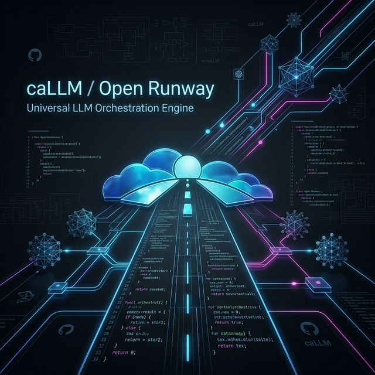

<p align="center">
  
</p>

# caLLM (Open Runway) — Build by Logic, Driven by Context.

[](LICENSE)
[](#)
[](#)

**caLLM** (Open Runway) é um orquestrador de LLMs de alta performance projetado para desenvolvedores seniores e "expert vibecoders" que buscam precisão técnica, lógica pura e eficiência extrema.

> **"Keep caLLM and Runway"** — Rode seus modelos na passarela da automação de elite com zero fricção mental.

---

## ⚡ O Pitch: Por que caLLM?

O desenvolvimento assistido por IA hoje é ruidoso. O caLLM elimina o ruído através de um motor de **Anti-Vibecoding**, focado em:
- **Redução de 90% no gasto de tokens** via gerenciamento inteligente de contexto.
- **Consistência Arquitetural**: Blindagem contra padrões "Frankenstein".
- **Hardware-Aware Performance**: Otimização nativa para GPU/CPU e streaming de baixa latência.

---

## 🚀 Funcionalidades Elite

### 🧠 Project Gita (Inteligência de Workspace)
Através do comando `callm gita`, o sistema realiza um check-up profundo do seu repositório:
- **Auto-Stack Detection**: Identifica Frameworks, Linguagens e Bancos de Dados.
- **Blueprint Mapping**: Gera metadados inteligentes em `/.callm/blueprint.json` para guiar a IA.
- **Zero-Friction Migration**: Garante que o contexto não se perca ao clonar ou migrar projetos entre plataformas (Replit, GitHub, PC local).

### 🌐 Browser Vision & Automation
Integração nativa de "visão" e interação com o navegador via motor DOM (Playwright):
- Automação de tarefas complexas direto no browser.
- Extração e interpretação de dados em tempo real.

### 🧬 Bio-Inspired Core (Neurônios e Sinapses)
- **Neurons**: Persistência de memórias e conhecimentos específicos do projeto.
- **Synapses**: Conexões automáticas entre neurônios que fortalecem o aprendizado da IA sobre o seu código.
- **Hygiene**: Sistema de limpeza de cadeias de pensamento para evitar alucinações.

---

## 🏗️ Orquestração Universal

O caLLM é agnóstico à stack. Seja React, Laravel, Python ou IoT, ele serve como base para qualquer projeto.

- **Conectividade Total**: Gemini Pro, Claude, OpenAI e modelos locais via Ollama/GGUF/llama.cpp.
- **Multi-Interface**:
  - **CLI Potente**: Para o fluxo rápido do terminal.
  - **Web Dashboard (Aurora)**: Interface de alta fidelidade com design Aurora Glassmorphism.
  - **Desktop (Tauri)**: Aplicativo nativo ultra-leve.

---

## 🛠️ Performance de Elite

Otimizado para quem roda modelos locais:
- **GPU Offloading (GGUF)**: Aceleração por hardware configurável por modelo.
- **Native Streaming**: Respostas token-a-token sem travamentos.
- **Auto-Unload**: Gerenciamento inteligente de memória que libera RAM/VRAM após 10 minutos de inatividade.

---

## 📜 ZEN.md & Filosofia
O coração do caLLM é o documento `ZEN.md`, que estabelece as diretrizes de desenvolvimento profissional:
- Anti-Vibecoding.
- AI-Jail.
- Security by Design.
- TDD & Resiliência.
- Arquitetura Hexagonal.
- 12-Factor App Compliance.
- OWASP Top 10.
- Pentesting.
- Clean Code.
- UI/UX.


---

## 🚀 Início Rápido

1. **Instale as dependências:**
   ```bash
   npm install
   ```

2. **Inicie a inteligência no seu projeto:**
   ```bash
   npx callm gita
   ```

3. **Abra o Dashboard:**
   ```bash
   npm run dev
   ```

---

**Build by Logic, Driven by Context.**  
Construído com ⚡ para os hackers que definem o futuro.

---

### Sponsor

[](https://www.buymeacoffee.com/ballanceado)
adge&logo=buy-me-a-coffee&logoColor=black)](https://www.buymeacoffee.com/ballanceado)